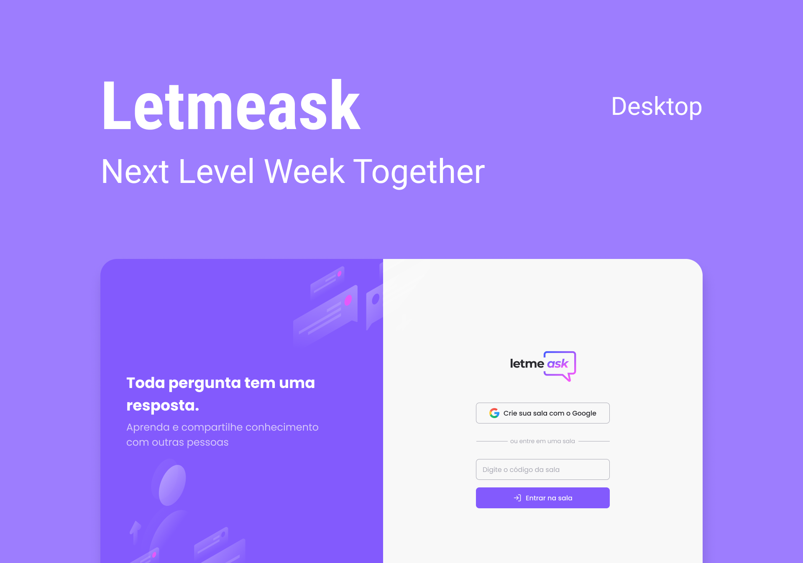

<p align="center">
  
</p>

<h3 align="center">Learn and share knowledge with others</h3>

<p align="center">
    
</p>
<p align="center">
 <a href="#about-the-project">About The Project</a> •
 <a href="#technologies">Technologies</a> • 
 <a href="#installation">Installation</a> • 
 <a href="#license">License</a>
</p>

<h1></h1>

## About The Project

Letmeask is a platform where people can create rooms to receive questions from an audience, who can vote for the more relevant questions by liking them.

This project was developed during the [Next Level Week Together](https://nextlevelweek.com/) hosted by [@Rocketseat](https://github.com/Rocketseat) on June 2021.

[View Demo](https://letmeask-nlw6-32b30.web.app/)

### Technologies

- [React](https://reactjs.org)
- [Firebase](https://firebase.google.com/)
- [Typescript](https://typescriptlang.org/)

## Instalation

Clone the project and cd into the folder

```bash
git clone https://github.com/PatrickMazzuco/letmeask.git && cd letmeask
```

Install the dependencies

```bash
yarn
```

Copy the example .env file and put your Firebase project config

```bash
cp .env.example .env.local
```

Run the application

```bash
yarn start
```

Access the project on your browser at [http://localhost:3000](http://localhost:3000)

### License

This project is licensed under the MIT License. See the [LICENSE](https://github.com/PatrickMazzuco/letmeask/blob/master/LICENSE) file for details.

---

<p align="center">Made by Patrick Mazzuco</p>
